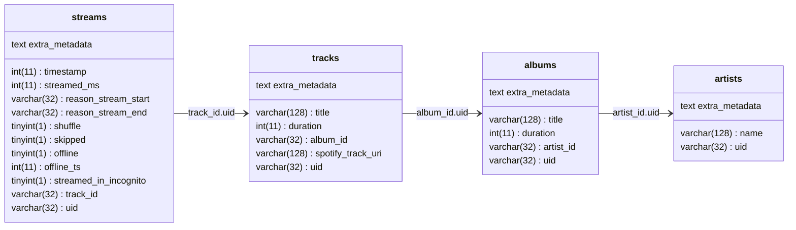

## DB Schema

```mermaid

classDiagram
direction LR
class albums {
   varchar(128) title
   int(11) duration
   varchar(32) artist_id
   text extra_metadata
   varchar(32) uid
}
class artists {
   varchar(128) name
   text extra_metadata
   varchar(32) uid
}
class streams {
   int(11) timestamp
   int(11) streamed_ms
   varchar(32) reason_stream_start
   varchar(32) reason_stream_end
   tinyint(1) shuffle
   tinyint(1) skipped
   tinyint(1) offline
   int(11) offline_ts
   tinyint(1) streamed_in_incognito
   varchar(32) track_id
   text extra_metadata
   varchar(32) uid
}
class tracks {
   varchar(128) title
   int(11) duration
   varchar(32) album_id
   varchar(128) spotify_track_uri
   text extra_metadata
   varchar(32) uid
}

albums  -->  artists : artist_id.uid
streams  -->  tracks : track_id.uid
tracks  -->  albums : album_id.uid


```